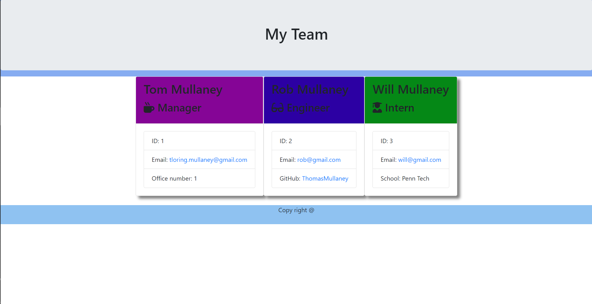
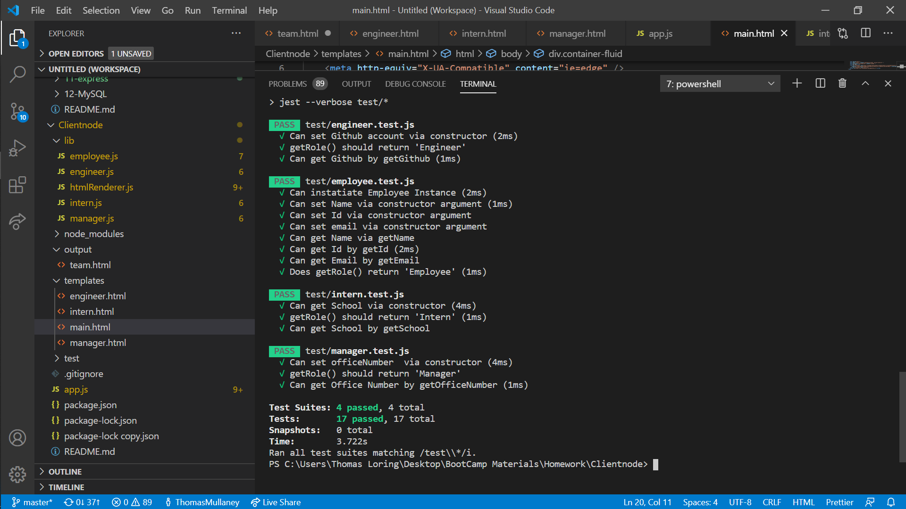

# team-profile-builder

    <h4>
    </a>
    
    
        
    </h4>

This is a software engineering team generator command line application

  <h4>
    <a href="https://github.com/ThomasMullaney/team-profile-builder">
      Github Repository
    </a>
     | 
<a href="https://drive.google.com/file/d/1f7p8tREe6L0jg3uhd76Qd-3nFaRpJmGU/view">
      Video Walkthrough
    </a>
  </h4>

<h3> Generated HTML Page Screenshot </h3>

<h3> Testing Screenshots </h3>

## Description:
### Command line application to build a profile of a software engineering team.

## Table of Contents:
     
1. [Installation](#installation)
2. [Usage](#usage)
3. [License](#license)
4. [Contributing](#contributing)
5. [Tests](#tests)
6. [Questions](#questions) 

## Installation: 
### npm install && node app.js

## Usage:
### This application allows a user to generate an HTML webpage that displays summaries for each individual member on the team.

## Technologies:
<ul>
<li>HTML</li>
<li>CSS</li>
<li>Javascript</li>
<li>Bootstrap</li>
<li>Github</li>
</ul>

## License:
### 
    
## Contributing:
### Tom Mullaney

## Tests:
### 

    
## Questions:
### github.com/ThomasMullaney
### tloring.mullaney@gmail.com
    